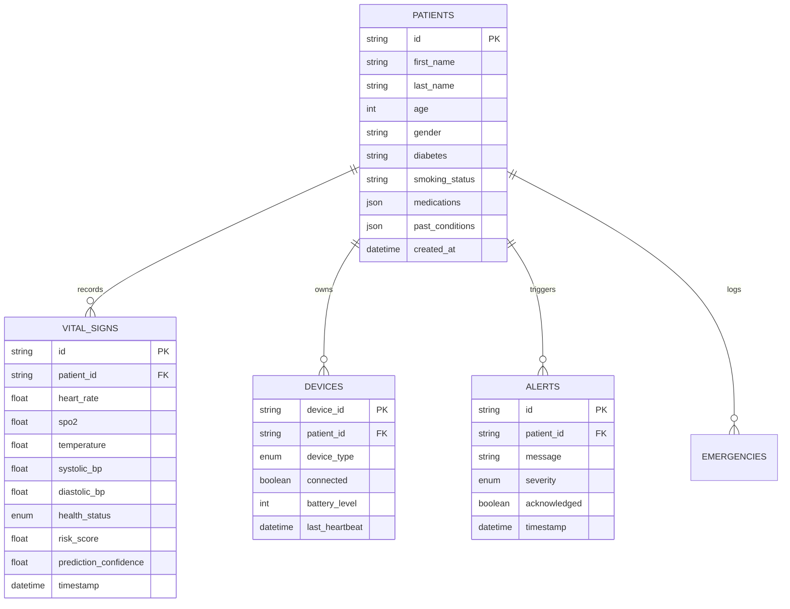

# Phase 0: Database Map & Schema Analysis

**Project**: HealSense Database Architecture  
**Date**: August 2, 2026  

---

## 1. Database Entity-Relationship Diagram

---

## 2. Gap Analysis & Proposed Schema Extensions

### A. Missing `vital_signs` Fields
1. **`bp_source`**: Currently un-tracked. Required values: `manual_entry`, `ble_cuff`, `hardware_uart`, `none`.
2. **`delayed_sync`**: Currently un-tracked. Boolean flag indicating whether the record was uploaded live or re-synced from ESP32 offline NVS buffer.

### B. Missing `devices` Fields
1. **`api_key_hash`**: Currently un-tracked. Required for authenticating raw HTTP telemetry payloads sent by ESP32 micro-controllers.

---

## 3. Migration Preparedness
An Alembic environment is active in `backend/alembic`. Phase 1 will generate the migration script: `<hash>_add_bp_source_and_delayed_sync.py`.
