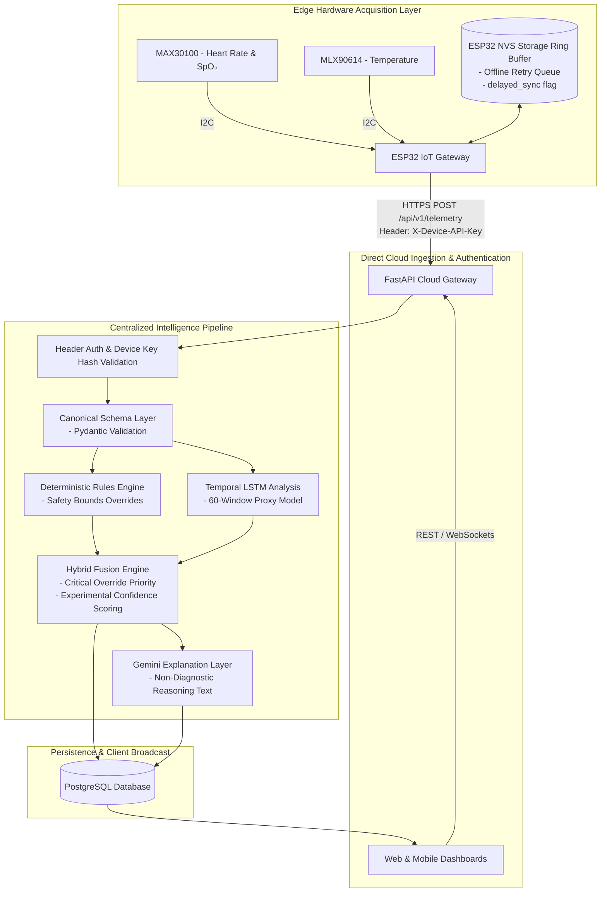

# HealSense Cloud-Native System Topology (v1.2.0)

> [!NOTE]
> **Raspberry Pi 5 Status**: Completely eliminated from production data path. Telemetry flows directly from ESP32 to FastAPI Cloud Backend over Wi-Fi/HTTPS.
